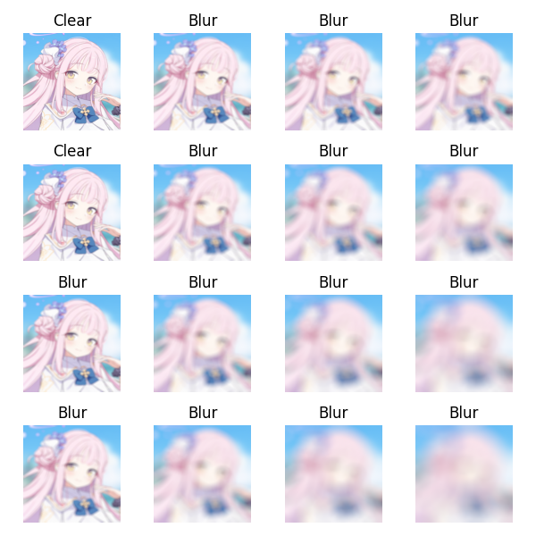

# Simply Blur Detector



> Original `Dockerfile` is tested on x86/64.

> If your computer is using Apple M1 series chips, please use `Dockerfile.M1` tested on my MBP.

Simply blur detector model is trained with 3 layers CNN by using `Tensorflow 2.7`.

It can be used to distinguish blur and non blur images.

> Blur Generator can be found in https://github.com/NatLee/Blur-Generator

## Usage

Run the demo, just use `bash start.sh`.

Or you can replace with your own non-blur images in folders `./data/test` and `./data/train` and run `./generate-blur-img.py`.

> If you want to fast run all steps, you can use the script `./fast-run.sh` or `./fast-run.bat`.

### Training & Predicting

> All materials are from the source https://bluearchive.wiki/wiki/Characters

- Training

  There is a function which can get image data from folder in `./src/blur_detection/utils/data_tools.py`.

  I suggest that you should use Docker to train to model.

  ```python

  from blur_detection import DetectionModel
  from blur_detection.utils.data_tools import get_data

  detector = DetectionModel() # without pre-trained model
  train_d, test_d = get_data('/data')
  detector.train(train_d, test_d)
  detector.save('/model/model.h5')
  ```

  The folder of `data` tree is shown as following.

  ```bash
  data
  |____train
  | |____blur
  | | |_____images
  | |____nonblur
  | | |_____images
  |____test
  | |____blur
  | | |_____images
  | |____nonblur
  | | |_____images
  ```

- Predicting

  If you want to predict an image and get a cool compare one like the image on the top of this document, just use the following script:

  ```
  from blur_detection import DetectionModel
  from blur_detection.utils import predict_blur_img

  detector = DetectionModel(<YOUR_MODEL_PATH>)
  predict_blur_img(
      detector,
      <YOUR_IMG_PATH>,
      save_fig_path=<YOUR_FIG_SAVE_PATH>
      blur_mode=<None|lens|gaussian|motion> # 4 types, default is gaussian
  )
  ```

## Author

Nat Lee
